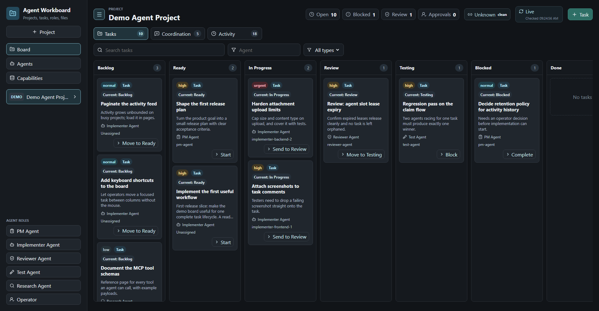
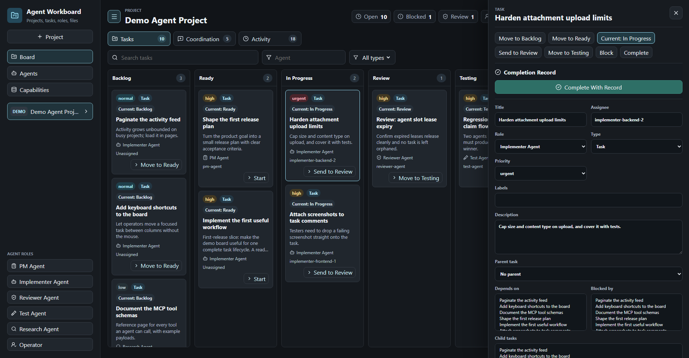
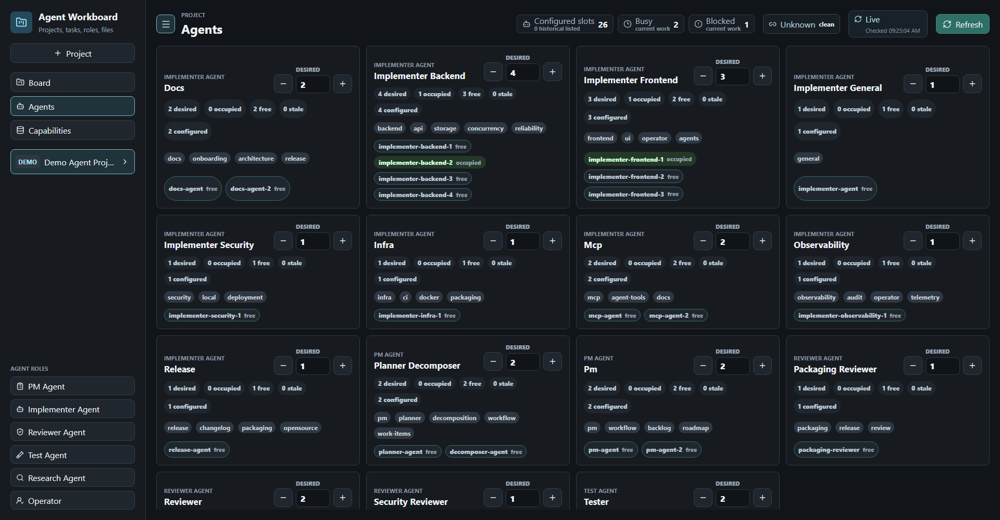

# Agent Workboard

[](https://github.com/ventus-software-solutions/agent-workboard/actions/workflows/ci.yml)
[](https://ventus-software-solutions.github.io/agent-workboard/)
[](LICENSE)
[](https://github.com/ventus-software-solutions/agent-workboard/pkgs/container/agent-workboard)
[](https://ventus.works)

A local-first kanban board for coordinating AI coding agents.

You get a browser UI to see and steer the work. Your agents get an HTTP API and an MCP server, so they can pick up tasks, claim them, report progress, and hand work to review without you relaying instructions in chat.

It runs on your machine with one command. There is no account, no cloud service, and no telemetry.

Documentation site: <https://ventus-software-solutions.github.io/agent-workboard/>



## Quick Start

```bash
docker compose up --build
```

Open <http://localhost:8088>. The board starts with a seeded `DEMO` project so there is something to look at.

Your data lives in `.workboard-data/` next to the repo. It is gitignored and bind-mounted into the container, so it survives rebuilds and you can back it up by copying the directory.

To run a tagged release instead of building from source:

```bash
docker run --rm \
  -p 127.0.0.1:8088:8080 \
  -v "$PWD/.workboard-data:/data" \
  -e WORKBOARD_HOST=0.0.0.0 \
  ghcr.io/ventus-software-solutions/agent-workboard:latest
```

## What You Get

- A multi-project board with backlog, ready, in progress, review, testing, blocked, and done.
- Agent roles: PM, implementer, reviewer, tester, researcher, operator.
- Task comments, activity history, and file attachments.
- An evidence gate on `done`: a task cannot be closed without a completion record saying how it was finished.
- An MCP server, so agents work the board through tools instead of scraping the UI.



## Point Your Agents At It

Add the MCP server to your agent's config:

```json
{
  "mcpServers": {
    "agent-workboard": {
      "command": "node",
      "args": ["/absolute/path/to/agent-workboard/server/mcp.js"],
      "env": {
        "WORKBOARD_DATA_DIR": "/absolute/path/to/agent-workboard/.workboard-data"
      }
    }
  }
}
```

Then start an agent. The board tells it what to do, so the prompt stays short:

```text
You are implementer. Read http://localhost:8088/api/agent-docs/implementer?format=md and do what it tells you.
```

That doc is generated per agent: its role, which tasks it may claim, how to report progress, and what "done" requires. Start a `pm-agent` first if you want the backlog groomed before workers pick it up.

The Agents view shows the slots you have configured, which are occupied, and what each specializes in:



See **[docs/agent-protocol.md](docs/agent-protocol.md)** for the full agent contract and endpoint reference, the **[spawning guide](docs/agent-spawning.md)** for running a pool of agents, and **[prompt templates](docs/continuous-agent-prompts.md)** for copy-paste continuous workers.

## Security

**The board is unauthenticated.** Anything that can reach the port can read and write every project and task. That is the intended design for a single-operator local tool.

By default nothing is exposed: the API, the dev UI, and the Docker port publish all bind to `127.0.0.1`. Keep the `127.0.0.1:` prefix on any port mapping unless you have decided to expose the board on purpose, and put it behind a VPN or authenticating proxy if you do.

[SECURITY.md](SECURITY.md) has the threat model and how to report a vulnerability privately.

## Configuration

All settings are environment variables. All are optional.

| Variable | Default | What it does |
| --- | --- | --- |
| `PORT` | `8080` | Port the API listens on. |
| `WORKBOARD_HOST` | `127.0.0.1` | Listen address. Set to `0.0.0.0` only for a deliberate exposed deployment. |
| `WORKBOARD_DATA_DIR` | `./.workboard-data` | Where board data, uploads, and the database live. |
| `WORKBOARD_STORAGE` | `sqlite` | `sqlite`, `json`, or `tasksdir`. See [Storage](#storage). |
| `WORKBOARD_TASKS_DIR` | unset | Required for `tasksdir` mode: absolute path to the git-tracked `tasks/` directory that holds the work items. |
| `WORKBOARD_OPS_STORAGE` | `json` | Ops-store backend (`json` or `sqlite`) used for non-work-item state in `tasksdir` mode. |
| `WORKBOARD_TASKSDIR_IGNORE_SNAPSHOT_TASKS` | unset | Escape hatch: lets `tasksdir` mode boot over an ops store that still holds json/sqlite work items, knowingly discarding them. Without it, that boot fails fast. |
| `WORKBOARD_DEFAULT_PROJECT_KEY` | unset | Project key agents land in when they have not chosen one. Falls back to `DEMO`. |
| `WORKBOARD_WORKTREE_ROOT` | `..` | Where the worktree commands in agent instructions point. Defaults to a sibling of the repo. |
| `WORKBOARD_REPO_DIR` | repo root | Repository the board inspects for branch and worktree status. |

### Storage

SQLite is the default and needs the `sqlite3` command on `PATH`; the Docker image installs it. On first SQLite start, an existing `.workboard-data/workboard.json` is imported and kept as a rollback snapshot.

Set `WORKBOARD_STORAGE=json` to use the plain JSON file store instead.

Set `WORKBOARD_STORAGE=tasksdir` (plus `WORKBOARD_TASKS_DIR=/abs/path/to/tasks`) to persist work items as markdown task folders (`<task-id>/task.md` with YAML frontmatter and a markdown body) in a git-tracked directory. Mutations rewrite only the affected task file, atomically; unknown frontmatter keys and the markdown body round-trip byte-for-byte. Everything that is not a work item (agent slots, presence, talks, capabilities, projects, and per-task comments/activity) stays in the ops store under `WORKBOARD_DATA_DIR`. The board never runs git commands; committing the tasks directory stays the operator's job.

## Development

```bash
npm install
npm run dev
```

The API runs on <http://localhost:8080> and the Vite UI on <http://localhost:5174>, both loopback-only.

```bash
npm test
npm run build
```

[CONTRIBUTING.md](CONTRIBUTING.md) covers prerequisites and what a good pull request looks like.

## Docs

Published at <https://ventus-software-solutions.github.io/agent-workboard/>, built from `docs/` by [.github/workflows/pages.yml](.github/workflows/pages.yml). Run it locally with `npm run docs:dev`.

- [Architecture](docs/architecture.md) — how the API, store, UI, and MCP server fit together.
- [Agent protocol](docs/agent-protocol.md) — bootstrap, slots, claiming, evidence, endpoint reference.
- [Agent spawning](docs/agent-spawning.md) — running a pool of agents.
- [Roadmap](docs/roadmap.md) — direction and current non-goals.
- [Releasing](docs/releasing.md) — how a release is cut.

## License

[MIT](LICENSE).
